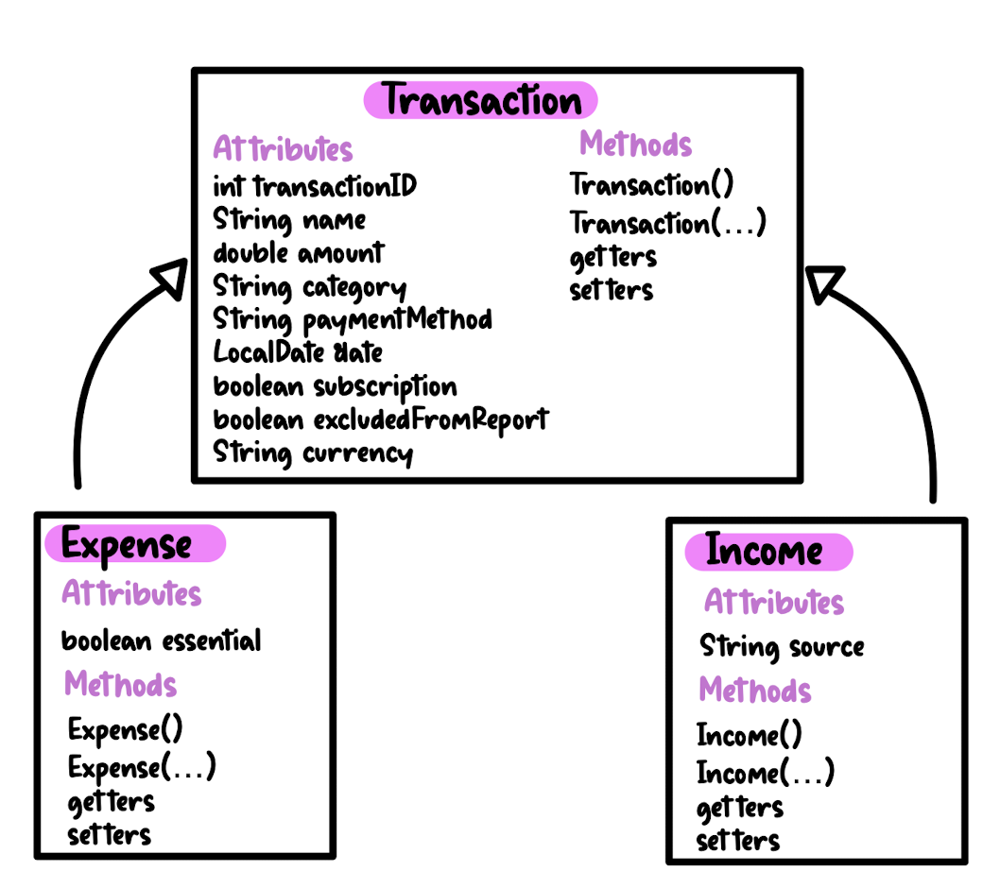

# Coinflip - aplicatie de gestionare a bugetului
### Bianca Balaș

## Descriere
Coinflip este o aplicatie pentru gestionarea bugetului personal care permite utilizatorilor sa isi monitorizeze tranzactiile, oferind functii de filtrare și generare de rapoarte lunare

## Obiective

### Monitorizarea veniturilor si cheltuielilor:
* permite utilizatorilor sa adauge si sa vizualizeze toate veniturile si cheltuielile
* suporta tranzactii recurente, cum ar fi abonamente, care se adauga automat in fiecare luna

### Filtrarea tranzactiilor:
* utilizatorii pot filtra tranzactiile dupa categorie (ex. transport, utilitati) si dupa tip (venit sau cheltuiala)

### Generarea rapoartelor:
* aplicatia poate genera rapoarte care rezuma totalul veniturilor si cheltuielilor pentru o anumita luna
* utilizatorul are optiunea de a exclude tranzactii din rapoarte pentru a personaliza analiza

## Arhitectura

### Clase

* clasa "Transaction"
  - Atribute:
    - transactionID (int): identifificatorul unic al tranzactiei
    - name (String): numele tranzactiei
    - amount (double): suma care a fost incasata sau decontata
    - category (String): categoria tranzactiei
    - paymentMethod (String): metoda de plata (ex. cash, card)
    - date (String): data tranzactiei
    - subscription (boolean): true daca tranzactia este de tip abonament, false altfel (valoarea implicita: false)
    - excpludedFromReport (boolean): true daca tranzactia va fi exclusa din raport, false altfel (valoarea implicita: false)
    - currency (String): moneda tranzactiei
  - Operatii:
    - metode de tip get pentru fiecare atribut
    - metode de tip set pentru fiecare atribut
   
* clasa "Income" extinde clasa "Transaction"
  - Atribute:
    - source (String): sursa venitului
   
* clasa "Expense" extinde clasa "Transaction"
  - Atribute:
    - isEssential (boolean): true daca tranzactia este esentiala (ex. chirie), false altfel (valoarea implicita: false)
   
### Tabele

* tabelul "users": contine utilizatorii, fiecare cu un identificator, username si parola
* tabelul "transactions": contine tranzactiile, cu detalii despre nume, suma, moneda, metoda de plata, data, daca este abonament, daca este exclusa din raport, tip, sursa (in cazul veniturilor), si daca este esentiala (in cazul cheltuielilor); are legatura catre tabelul "users" prin campul "userID"

### Pagini

## Functionalitati/Exemple utilizare
### Inregistrare:
* Utilizatorul completeaza un formular cu informatiile de inregistrare (username, parola)
* Verifica daca username-ul e unic

### Autentificare:
* Utilizatorul introduce username-ul si parola alese in timpul inregistrarii
* Daca datele sunt corecte, utilizatorul este autentificat

### Adaugarea unei tranzactii:
* Utilizatorul poate adauga o noua tranzactie (venit sau cheltuiala) completand un formular cu urmatoarele detalii: nume, suma, moneda, categoria, metoda de plata, data, si tipul de tranzactie (abonament sau nu)
* Utilizatorul poate selecta daca tranzactia sa fie exclusa din rapoarte

### Editarea unei tranzactii:
* Utilizatorul poate edita o tranzactie existenta

### Stergerea unei tranzactii:
* Utilizatorul poate sterge o tranzactie din lista

### Filtrarea tranzactiilor:
* Utilizatorul poate filtra tranzactiile dupa categorie sau dupa tip

### Generarea unui raport lunar:
* Utilizatorul poate genera un raport al tranzactiilor pentru o luna si un an specificat
